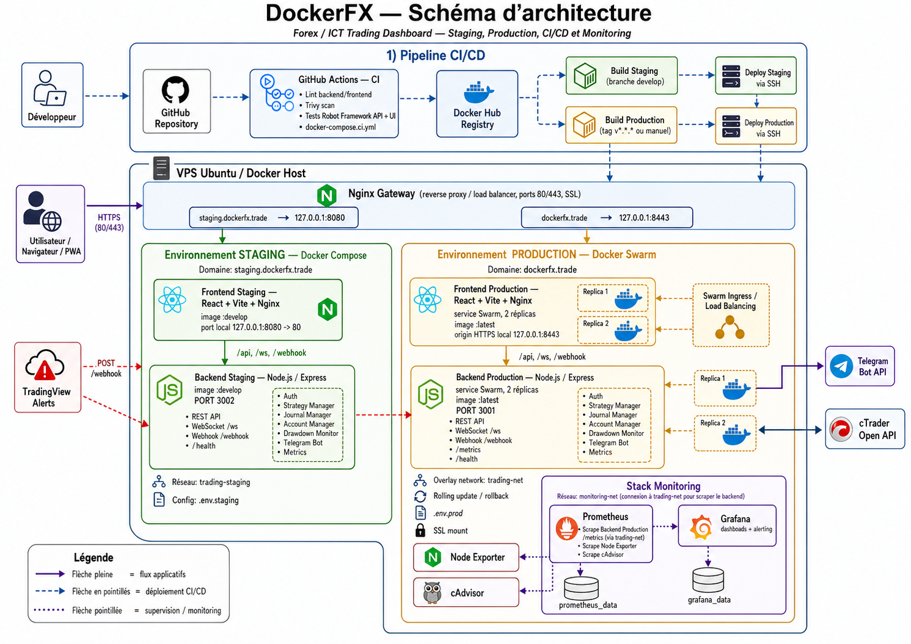

# DockerFX — Schéma d’architecture

## 1. Objectif du schéma

Ce document explique le contenu du schéma d’architecture de l’application **DockerFX**, une plateforme de dashboard Forex / ICT Trading permettant de recevoir des signaux TradingView, de les traiter via un backend Node.js, de les afficher dans une interface React et d’interagir avec des services externes comme Telegram et cTrader.

Le schéma présente l’architecture globale du projet en couvrant :

- les environnements **staging** et **production** ;
- les composants applicatifs et leurs interactions ;
- les composants d’infrastructure : réseau, reverse proxy, load balancing, stockage ;
- le pipeline **CI/CD** ;
- les outils de **monitoring**.

---

## 2. Schéma d’architecture



---

## 3. Environnements

L’architecture DockerFX est organisée autour de deux environnements principaux :

- **staging**, pour tester les changements avant mise en production ;
- **production**, pour l’application accessible aux utilisateurs finaux.

### 3.1 Environnement Staging

L’environnement **staging** permet de valider les modifications avant leur livraison en production.

Il est basé sur **Docker Compose** et utilise les images Docker taguées `develop`.

Principales caractéristiques :

| Élément | Description |
|---|---|
| Domaine | `staging.dockerfx.trade` |
| Orchestration | Docker Compose |
| Frontend | React + Vite + Nginx |
| Image frontend | `ict-trading-frontend:develop` |
| Backend | Node.js / Express |
| Image backend | `ict-trading-backend:develop` |
| Port backend | `3002` |
| Port local frontend | `127.0.0.1:8080 -> 80` |
| Réseau Docker | `trading-staging` |
| Fichier de configuration | `.env.staging` |

Cet environnement est utilisé pour tester les changements issus de la branche `develop`.

### 3.2 Environnement Production

L’environnement **production** correspond à l’application utilisée en conditions réelles.

Il est basé sur **Docker Swarm**, ce qui permet une meilleure disponibilité grâce à la réplication des services et au load balancing.

Principales caractéristiques :

| Élément | Description |
|---|---|
| Domaine | `dockerfx.trade` |
| Orchestration | Docker Swarm |
| Frontend | React + Vite + Nginx |
| Image frontend | `ict-trading-frontend:latest` |
| Backend | Node.js / Express |
| Image backend | `ict-trading-backend:latest` |
| Port backend | `3001` |
| Port HTTPS local | `127.0.0.1:8443` |
| Réplicas frontend | 2 |
| Réplicas backend | 2 |
| Réseau Docker | `trading-net` |
| Fichier de configuration | `.env.prod` |
| Déploiement | Rolling update avec rollback possible |

La production est conçue pour être plus robuste que le staging, avec des mécanismes de déploiement progressif et de retour arrière en cas d’échec.

---

## 4. Composants applicatifs et interactions

L’application DockerFX est composée principalement de deux composants applicatifs :

1. le **frontend** ;
2. le **backend**.

### 4.1 Frontend

Le frontend est développé avec :

- **React** ;
- **Vite** ;
- **Nginx**.

Rôle du frontend :

- afficher le dashboard de trading ;
- permettre la connexion utilisateur ;
- afficher les signaux reçus ;
- afficher les positions, les statistiques et le journal de trading ;
- communiquer avec le backend via les routes `/api` ;
- recevoir les mises à jour temps réel via WebSocket `/ws`.

Le frontend est servi par Nginx, qui permet également de rediriger certaines requêtes vers le backend.

### 4.2 Backend

Le backend est développé avec :

- **Node.js** ;
- **Express** ;
- **WebSocket**.

Le backend expose plusieurs routes importantes :

| Route | Rôle |
|---|---|
| `/api` | API principale de l’application |
| `/api/auth/login` | Authentification utilisateur |
| `/webhook` | Réception des alertes TradingView |
| `/ws` | Communication temps réel avec le frontend |
| `/health` | Vérification de santé du service |
| `/metrics` | Exposition des métriques pour Prometheus |

### 4.3 Modules internes du backend

Le backend contient plusieurs modules fonctionnels :

| Module | Rôle |
|---|---|
| Auth | Gestion de l’authentification |
| Strategy Manager | Gestion des stratégies de trading |
| Journal Manager | Gestion du journal des trades |
| Account Manager | Gestion des comptes de trading |
| Drawdown Monitor | Surveillance du drawdown |
| Telegram Bot | Envoi de notifications et réception de commandes Telegram |
| Metrics | Exposition des métriques applicatives |

### 4.4 Interactions principales

Les principales interactions applicatives sont les suivantes :

1. L’utilisateur accède au dashboard via son navigateur ou en mode PWA.
2. Le trafic HTTPS arrive sur la **Nginx Gateway**.
3. La gateway route la requête vers l’environnement adapté : staging ou production.
4. Le frontend communique avec le backend via `/api` et `/ws`.
5. TradingView envoie les signaux au backend via `POST /webhook`.
6. Le backend traite le signal, met à jour le dashboard et peut envoyer une notification Telegram.
7. Le backend peut interagir avec l’API cTrader pour les données de compte, positions ou exécution.

---

## 5. Composants d’infrastructure

### 5.1 VPS Ubuntu / Docker Host

L’ensemble de l’application est hébergé sur un **VPS Ubuntu** faisant office d’hôte Docker.

Le VPS contient :

- l’environnement staging ;
- l’environnement production ;
- la gateway Nginx ;
- la stack de monitoring ;
- les réseaux Docker ;
- les volumes persistants nécessaires.

### 5.2 Nginx Gateway

Le composant **Nginx Gateway** est placé devant les environnements applicatifs.

Son rôle est de :

- recevoir le trafic HTTP/HTTPS sur les ports `80` et `443` ;
- rediriger le trafic HTTP vers HTTPS ;
- gérer la terminaison SSL ;
- router les domaines vers le bon environnement ;
- agir comme reverse proxy ;
- transmettre les connexions WebSocket.

Routage principal :

| Domaine public | Destination interne |
|---|---|
| `staging.dockerfx.trade` | `127.0.0.1:8080` |
| `dockerfx.trade` | `127.0.0.1:8443` |

### 5.3 Réseaux Docker

L’architecture utilise plusieurs réseaux Docker :

| Réseau | Type | Usage |
|---|---|---|
| `trading-staging` | Bridge / externe | Communication entre frontend et backend staging |
| `trading-net` | Overlay Docker Swarm | Communication entre services de production |
| `monitoring-net` | Bridge | Communication entre Prometheus, Grafana, Node Exporter et cAdvisor |

Le monitoring peut également accéder au réseau de production afin de scraper les métriques du backend.

### 5.4 Load balancing

En production, Docker Swarm permet de répliquer les services et de répartir les requêtes.

Le schéma représente :

- 2 réplicas du frontend ;
- 2 réplicas du backend ;
- un mécanisme de **Swarm Ingress / Load Balancing**.

Cela permet d’améliorer :

- la disponibilité ;
- la résilience ;
- la continuité de service pendant les déploiements ;
- la capacité de rollback en cas de problème.

### 5.5 Stockage

La stack de monitoring utilise des volumes Docker persistants :

| Volume | Usage |
|---|---|
| `prometheus_data` | Conservation des métriques Prometheus |
| `grafana_data` | Conservation des dashboards, configurations et données Grafana |

Ces volumes permettent de conserver les données même après un redémarrage des conteneurs.

---

## 6. Pipeline CI/CD

Le pipeline CI/CD est basé sur :

- **GitHub Repository** ;
- **GitHub Actions** ;
- **Docker Hub Registry** ;
- déploiement SSH vers le VPS.

### 6.1 Intégration continue

Lorsqu’un développeur pousse du code sur GitHub, la CI exécute automatiquement plusieurs contrôles :

- lint du backend ;
- lint du frontend ;
- scan de sécurité avec Trivy ;
- tests API avec Robot Framework ;
- tests UI avec Robot Framework ;
- démarrage d’un environnement de test via `docker-compose.ci.yml`.

Objectif : vérifier la qualité, la sécurité et le bon fonctionnement de l’application avant build et déploiement.

### 6.2 Build Staging

Lorsque la CI réussit sur la branche `develop`, les images de staging sont construites et envoyées vers Docker Hub.

Images générées :

```text
ict-trading-backend:develop
ict-trading-frontend:develop
```

### 6.3 Déploiement Staging

Le déploiement staging se fait via SSH vers le VPS.

Le serveur récupère les images Docker taguées `develop`, puis redémarre les services de staging avec Docker Compose.

### 6.4 Build Production

La production est construite à partir d’un tag Git au format :

```text
v*.*.*
```

ou via un déclenchement manuel dans GitHub Actions.

Les images générées sont publiées avec :

- un tag de version, par exemple `v1.4.7` ;
- le tag `latest`.

Images générées :

```text
ict-trading-backend:vX.Y.Z
ict-trading-backend:latest
ict-trading-frontend:vX.Y.Z
ict-trading-frontend:latest
```

### 6.5 Déploiement Production

Le déploiement production est effectué via SSH sur le VPS.

Docker Swarm met à jour les services :

```text
ict-prod_backend
ict-prod_frontend
```

Le déploiement utilise :

- une mise à jour progressive ;
- un délai entre les mises à jour ;
- une vérification de convergence ;
- un rollback possible en cas d’échec.

---

## 7. Outils de monitoring

La stack de monitoring permet de surveiller l’état de l’application, du VPS et des conteneurs Docker.

Elle comprend :

- **Prometheus** ;
- **Grafana** ;
- **Node Exporter** ;
- **cAdvisor**.

### 7.1 Prometheus

Prometheus collecte les métriques depuis plusieurs sources :

| Source | Métriques collectées |
|---|---|
| Backend production `/metrics` | Métriques applicatives |
| Node Exporter | Métriques système du VPS |
| cAdvisor | Métriques des conteneurs Docker |
| Prometheus | Auto-monitoring |

Les données Prometheus sont stockées dans le volume `prometheus_data`.

### 7.2 Grafana

Grafana permet de visualiser les métriques collectées par Prometheus.

Il fournit :

- des dashboards ;
- des graphiques ;
- de l’alerting ;
- une vision globale de la santé de l’infrastructure.

Les données Grafana sont stockées dans le volume `grafana_data`.

### 7.3 Node Exporter

Node Exporter collecte les métriques du VPS :

- CPU ;
- mémoire ;
- disque ;
- réseau ;
- charge système.

### 7.4 cAdvisor

cAdvisor collecte les métriques des conteneurs Docker :

- consommation CPU ;
- consommation mémoire ;
- réseau ;
- état des conteneurs ;
- performances Docker.

---

## 8. Légende du schéma

Le schéma utilise trois types de flux :

| Type de flèche | Signification |
|---|---|
| Flèche pleine | Flux applicatifs |
| Flèche en pointillés | Déploiement CI/CD |
| Flèche pointillée | Supervision / monitoring |

---

## 9. Outils suggérés pour réaliser le schéma

Le schéma peut être réalisé ou reproduit avec un outil de modélisation visuelle tel que :

- **Draw.io / diagrams.net** ;
- **Lucidchart** ;
- **Excalidraw** ;
- **Miro** ;
- **Figma / FigJam** ;
- ou tout outil équivalent.

Dans le cadre de ce document, le schéma a été généré sous forme d’image et intégré directement dans ce fichier Markdown.

---

## 10. Conclusion

Le schéma d’architecture DockerFX montre une application organisée autour d’une séparation claire entre **staging** et **production**.

L’environnement staging permet de tester les changements issus de la branche de développement, tandis que la production utilise Docker Swarm pour assurer une meilleure disponibilité grâce aux réplicas, au load balancing et aux mécanismes de rolling update / rollback.

L’ensemble est complété par :

- un pipeline CI/CD automatisé ;
- une gateway Nginx pour le routage HTTPS ;
- des réseaux Docker séparés ;
- une stack de monitoring basée sur Prometheus, Grafana, Node Exporter et cAdvisor.

Cette architecture répond aux exigences demandées : environnements, composants applicatifs, infrastructure, pipeline CI/CD et monitoring.
